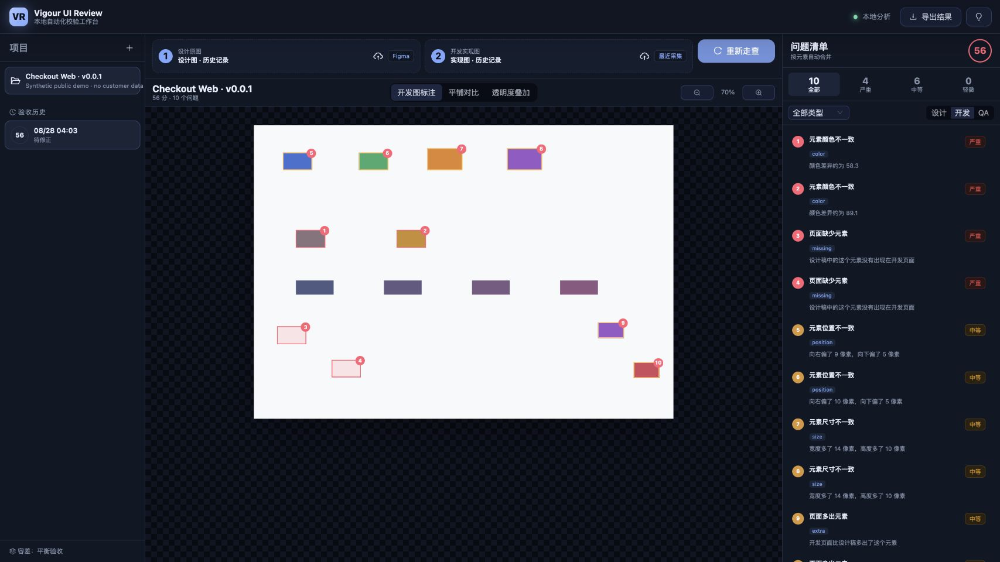

# Vigour UI Review

[English](README.md) · [产品 SPEC](docs/spec/PRODUCT_SPEC.md) · [技术架构](docs/architecture/TECHNICAL_ARCHITECTURE.md) · [安全说明](docs/SECURITY.md)

Vigour UI Review 是一款本地优先的 Web 设计验收工作台。它将开发实现图与设计源进行对齐，检测位置、尺寸、颜色、缺失、多余及可选 OCR 文字差异，并转换为可复核的问题和可导出的证据。

> 当前状态：`v0.0.1` 是面向 macOS 14+ Apple Silicon 的未签名开发者预览版。当前准确率基准来自确定性合成图片，不能等同于真实业务页面的生产准确率。



## 核心能力

- OpenCV/PaddleOCR 本地分析，检测和评分不依赖 AI。
- Chrome Manifest V3 当前视口和整页采集。
- 开发图标注、平铺对比、透明度叠加三种模式。
- 项目导航、对比画布、问题清单固定三栏工作台。
- 像素级大白话问题描述、严重程度和同元素分组。
- PNG、Markdown、JSON 导出。
- 使用最小权限 PAT 导入指定 Figma Frame。
- 可选 OpenAI、Gemini、Kimi、DeepSeek 解释，并使用一次性同意回执。
- 九套内置主题，以及自定义主题导入、编辑、复制和导出。
- 凭据存入 macOS 钥匙串，本地 API 只监听 `127.0.0.1`。

## 安装预览版

1. 从 [GitHub Releases](../../releases/latest) 下载 `Vigour-UI-Review-v0.0.1-macos-arm64.zip` 和对应 `.sha256`。
2. 校验文件：

   ```bash
   shasum -a 256 -c Vigour-UI-Review-v0.0.1-macos-arm64.zip.sha256
   ```

3. 解压后，首次启动请按住 Control 点击 `start.command`，选择“打开”。`v0.0.1` 尚未签名。
4. 等待浏览器自动打开 `http://127.0.0.1:4179/`。OCR 首次冷启动可能需要约 30 秒。

安装 Chrome 采集扩展：打开 `chrome://extensions`，启用“开发者模式”，选择“加载已解压的扩展程序”，然后选择安装包中的 `chrome-extension/`。令牌配对和故障排查见[安装说明](docs/INSTALL.md)。

## 从源码运行

环境要求：macOS 14+ Apple Silicon、Node.js 24+、pnpm 11+、[uv](https://docs.astral.sh/uv/)。

```bash
pnpm install --frozen-lockfile
uv sync --project apps/vision-engine --python 3.12 --extra dev --extra ocr --frozen
pnpm release:check
pnpm start:local
```

生成完整离线安装包：

```bash
pnpm package:dev
pnpm package:check
pnpm package:smoke
pnpm package:archive
```

依赖目录、虚拟环境、基准输出、构建产物和安装包均不会进入 Git。

## 合成演示数据

[`examples/demo`](examples/demo) 中的图片由程序生成，不包含任何真实用户或第三方产品数据。将 `design.png` 作为设计图、`implementation.png` 作为开发实现图上传，即可试跑本地流程。

## 隐私模型

核心对比完全离线，应用不包含遥测。Figma 与 AI 均为可选集成，使用用户自行提供的凭据。每次 AI 调用前，界面会明确展示供应商、模型、任务、问题范围和是否包含图片；同意回执十分钟后失效且只能使用一次。

运行数据位于：

```text
~/Library/Application Support/Vigour UI Review/
```

首次启动会将旧版 `Design Acceptance 2.0` 数据原子复制到新目录，同时保留旧目录用于恢复。详情见[隐私说明](docs/PRIVACY.md)和[安全说明](docs/SECURITY.md)。

## 已知限制

- 仅支持 Apple Silicon；[当前 PaddlePaddle macOS 包支持 arm64、不支持 x86_64](https://www.paddlepaddle.org.cn/documentation/docs/en/install/pip/macos-pip_en.html)。
- 开发者安装包尚未签名和 notarization。
- Chrome 扩展尚未上架 Chrome Web Store。
- 当前是合成回归基准，仍需补充人工标注的真实页面盲测。
- Canvas、WebGL、视频内部、跨域 iframe 和交互回放不属于 `v0.0.1` 范围。

## 参与贡献

欢迎提交 Issue 和 Pull Request。请先阅读[贡献指南](CONTRIBUTING.md)和[行为准则](CODE_OF_CONDUCT.md)。安全漏洞请按照[安全说明](docs/SECURITY.md)私密报告。

## 许可证

Copyright © 2026 Vigour UI。基于 [MIT License](LICENSE) 开源。
