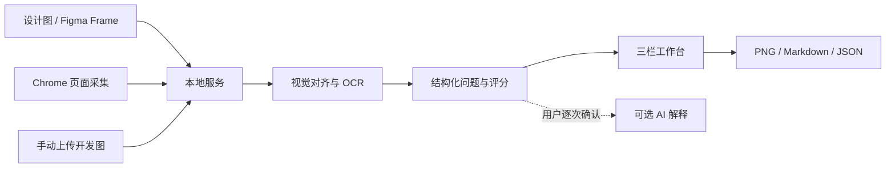

# Vigour UI Review 0.0.1 开发过程记录

| 项目 | 内容 |
| --- | --- |
| 记录版本 | 0.0.1 |
| 记录日期 | 2026-08-28 |
| 产品形态 | macOS 本地工作台 + Chrome MV3 扩展 |
| 当前阶段 | 个人本地版 MVP，可开发者安装和独立运行 |
| 目标平台 | macOS 14+、Apple Silicon、Chrome |

## 1. 项目背景

传统设计验收需要设计师和开发人员反复切换设计稿、页面截图和沟通工具，主要存在以下问题：

1. 颜色、位置和尺寸差异依赖人工查找，耗时且容易遗漏。
2. “有点偏”“大小不太对”等描述缺少可执行的量化信息。
3. 问题位置、严重程度和修改顺序不清晰。
4. 页面截图、设计稿、AI 服务和第三方平台之间存在隐私与凭据安全风险。

本次开发目标是构建一套本地优先的设计验收工具。用户提供设计原图和开发实现图后，系统自动完成视觉对齐、差异检测、问题描述、证据标注和结果导出，同时保留 Figma 与多家 AI 服务的可选扩展能力。

## 2. 需求形成过程

需求通过逐项确认逐步收敛，最终确定以下关键方向：

- 优先覆盖 Web 页面，移动端暂不进入首版范围。
- 采用 Chrome 插件采集开发页面，支持当前视口和整页截图。
- 工作台保持固定三栏布局：左侧项目导航、中间对比画布、右侧问题清单。
- 支持开发图标注、平铺对比、透明度叠加三种模式。
- 校验结果采用大白话量化表达，例如“向左偏了 4 像素”“宽了 8 像素”。
- 检测和评分默认完全离线；AI 只负责解释现有问题，不参与核心判定。
- 首版 Figma 接入采用 Personal Access Token，预留 OAuth 升级接口。
- AI 服务覆盖 OpenAI、Gemini、Kimi 和 DeepSeek。
- 采用 macOS 钥匙串保存第三方凭据，禁止写入 SQLite、浏览器存储、URL 或日志。
- 保留光效版本的视觉风格，并增加九套预设主题和自定义主题编辑能力。
- “Monad 羊皮纸”主题主色最终确定为奶油黄。

需求最终沉淀为产品 SPEC 和技术架构文档：

- [产品 SPEC](spec/PRODUCT_SPEC.md)
- [技术架构](architecture/TECHNICAL_ARCHITECTURE.md)

## 3. 第一性原理拆解

工具的核心不是“比较两张图片”，而是把设计意图与开发结果转换成可以定位、量化、复核和流转的问题。因此系统被拆分为五个基本环节：

1. **可靠采集**：获得尺寸和上下文可信的设计图、开发图及页面语义信息。
2. **空间对齐**：先消除整体偏移，再判断局部位置和尺寸差异。
3. **差异检测**：分别识别位置、尺寸、颜色、文字、缺失和多余元素。
4. **可解释输出**：将算法结果转换为通俗描述、严重程度和证据框。
5. **安全流转**：本地保存、人工复核、导出或在明确同意后调用外部服务。

整体数据链路如下：



## 4. 技术方案

### 4.1 技术栈

| 模块 | 技术选择 | 作用 |
| --- | --- | --- |
| Monorepo | pnpm workspace | 管理多个 TypeScript 应用和共享包 |
| 工作台 | Vue 3、TypeScript、Vite、Ant Design Vue、Pinia | 三栏工作台和主题系统 |
| 本地服务 | Node.js、Fastify、Zod、SQLite | API、鉴权、任务与数据管理 |
| Chrome 扩展 | Manifest V3、TypeScript、Vite | 页面截图和 DOM/样式采集 |
| 视觉引擎 | Python 3.12、OpenCV、NumPy、Pillow | 对齐、差异检测、证据图生成 |
| OCR | PaddleOCR、PaddlePaddle | 本地文字检测与识别 |
| 测试 | Vitest、Pytest | TypeScript 与 Python 自动化测试 |
| 打包 | esbuild、自包含 Node/Python 运行时 | 生成可移动开发者安装包 |

### 4.2 项目结构

```text
Vigour-UI-Review/
├── apps/
│   ├── chrome-extension/   # Chrome MV3 采集扩展
│   ├── local-service/      # localhost API 与数据服务
│   ├── vision-engine/      # Python 视觉与 OCR 引擎
│   └── workbench/          # Vue 三栏工作台
├── packages/
│   ├── contracts/          # Zod 契约与 JSON Schema
│   └── scoring/            # 问题评分与严重程度
├── scripts/                # 启动、打包、基准和发布检查
├── docs/                   # 安装、安全、基准和开发记录
└── release/                # 自包含开发者交付包
```

### 4.3 核心边界

- 本地服务只监听 `127.0.0.1:4179`。
- 核心检测不依赖云端 API，没有 API Key 也可以使用。
- Figma 与 AI 均属于可选能力，不能阻断离线验收流程。
- AI 只能输出说明和建议，不允许直接修改用户代码仓库。
- Chrome 插件只采集用户主动触发的页面，不常驻上传页面内容。

## 5. 分阶段开发记录

开发采用 M0 至 M6 的里程碑推进方式。每个里程碑结束后先执行测试，再进行一次对抗式审查，发现问题后修复并重新验证。

### M0：规范、契约与安全基线

完成内容：

- 固化产品 SPEC、技术架构、非目标和成功标准。
- 创建 pnpm monorepo、共享 Zod 契约和 JSON Schema。
- 建立 SQLite migrations、任务状态机和问题评分模型。
- 实现 localhost Bearer Token、CSRF、Origin 和 CORS 防护。

对抗式审查重点：

- API 输入是否全部经过 schema 校验。
- 非法任务状态是否可能绕过状态机。
- 浏览器扩展跨域预检是否受到误拦截。
- session token 文件权限和比较方式是否安全。

审查结果：补齐 Chrome 扩展的 CORS preflight 处理，并使用常量时间方式比较凭据。

### M1：Chrome 页面采集

完成内容：

- 创建 Manifest V3 扩展。
- 支持当前视口截图和分段整页截图。
- 采集 DOM 结构、元素边界与 computed styles。
- 截图期间冻结动画，等待懒加载内容，并控制 Chrome API 调用频率。
- 整页截图在本地拼接并转换为开发实现图资产。
- 工作台增加“最近采集”入口。

对抗式审查重点：

- 超长页面是否导致内存或尺寸失控。
- 页面滚动、固定元素和动画是否产生重复内容。
- 上传内容是否可能伪造格式或突破大小限制。

审查结果：增加图片魔数、尺寸、总字节数、路径和私有文件权限校验；为采集记录增加 `image_asset_id`，保证截图可以直接进入分析流程。

### M2：本地视觉与 OCR 引擎

完成内容：

- 建立 Python JSON-RPC 常驻子进程。
- 使用 ORB 和 phase correlation 完成全局对齐。
- 实现位置、尺寸、颜色、缺失和多余元素检测器。
- 接入 PaddleOCR，生成文字差异问题。
- 生成带问题框和编号的 PNG 证据图。
- Node 侧实现超时、终止和自动重启机制。

对抗式审查重点：

- 两张图尺寸不一致时是否产生错误坐标。
- 视觉进程卡死或崩溃后是否拖垮本地服务。
- 输入路径是否可能逃逸数据目录。
- OCR 不可用时是否影响基础图像检测。

审查结果：加入安全路径解析、尺寸冲突响应、RPC 白名单和进程恢复策略；OCR 保持可选，基础检测不依赖 OCR 成功。

### M3：完整三栏工作台

完成内容：

- 恢复并固定“项目导航 / 对比画布 / 问题清单”三栏布局。
- 提供开发图标注、平铺对比和透明度叠加模式。
- 提供缩放、透明度、严重程度和问题类型过滤。
- 支持设计、开发、QA 三种角色视图。
- 展示评分、历史记录、问题分组和处理状态。
- 支持 PNG、Markdown 和 JSON 导出。
- 建立九套预设主题和自定义主题编辑器。
- 支持主题导入、复制、导出和实时预览。
- 将“Monad 羊皮纸”调整为奶油黄主色。

对抗式审查重点：

- 三种对比模式是否真正显示两张独立图片。
- 三栏在常用桌面尺寸下是否出现不可操作区域。
- 主题切换是否只替换颜色而破坏布局和可读性。
- 同一元素的多个差异是否造成重复标注。

审查结果：浏览器端完成真实交互验收；相同图片分析得到 100 分和 0 个问题；平铺、叠加、主题切换及自定义主题编辑均通过验证。

### M4：Figma 接入

完成内容：

- 支持解析 Figma 文件和节点 URL。
- 使用 `file_content:read` 最小权限读取节点和导出图片。
- 将 PAT 保存到 macOS 钥匙串。
- 展平 Figma 节点语义，并与页面 DOM 语义进行匹配。
- 为后续 OAuth、多人使用和设计系统变量接入预留边界。

对抗式审查重点：

- Figma URL 是否可能造成 SSRF 或访问内网地址。
- 重定向后是否可能绕过主机校验。
- PAT 是否出现在命令行参数、数据库或日志中。
- 超大文件和节点树是否可能耗尽资源。

审查结果：加入协议、域名、私有地址、重定向、文件大小和节点数量限制；钥匙串命令通过 stdin 传递秘密，避免进入进程参数。

### M5：可选 AI 解释

完成内容：

- 建立统一 AI Provider Adapter。
- 接入 OpenAI Responses、Gemini GenerateContent、Kimi 和 DeepSeek Chat Completions。
- 支持“解释问题”和“推断页面业务逻辑”两个入口。
- API Key 只保存在 macOS 钥匙串。
- 外发前明确展示数据范围并要求用户确认。
- 创建与 provider、model、task 和 payload 哈希绑定的一次性同意回执。

对抗式审查重点：

- AI 是否会改变核心检测结果或评分。
- 页面文字是否可能通过提示注入改变系统指令。
- 同意操作是否可被重复消费或替换请求内容。
- 不支持图片的模型是否仍可能收到图片数据。

审查结果：AI 保持只读解释角色；加入内容转义、输出 schema、载荷和响应限制、图片能力判断，以及十分钟有效且只能消费一次的同意回执。

### M6：发布、基准与可搬迁交付

完成内容：

- 使用 esbuild 打包本地服务并由同一端口提供工作台静态文件。
- 编写 `start.command`、`start-local.mjs` 和 `vision-engine/run`。
- 在交付包内嵌 Node.js、Python 3.12、视觉和 OCR 依赖。
- 建立数据库恢复测试、确定性视觉基准和统一发布门禁。
- 生成 `release/Vigour-UI-Review-v0.0.1-macos-arm64/` 开发者安装包。

本阶段的主要审查发现与修复：

1. **Python venv 不可搬迁**：首次打包直接复制虚拟环境，内部解释器仍指向原机器路径。修复为复制独立 Python runtime，并用 `uv pip --target` 安装依赖，运行器全部使用相对路径。
2. **视觉引擎冷启动超时**：Paddle/OpenCV 首次启动约需 25 秒，原 15 秒等待不足。启动器等待上限调整为 60 秒。
3. **Token 出现在查询参数**：启动 URL 最初采用 `?token=`，可能进入请求记录。改成 `#token=`，工作台读取后立即清除地址栏内容。
4. **发布测试误扫第三方依赖**：交付包归位后，Pytest 收集了包内两万多个第三方自带测试。发布脚本改为显式指定项目配置和 `apps/vision-engine/tests`。
5. **安装说明路径错误**：包内说明仍使用源码插件路径。最终改为交付包优先说明，并指向 `chrome-extension/`。
6. **Python 运行时泄漏构建机路径**：复制的运行时包含绝对软链接、`direct_url.json`、sysconfig 前缀与 Mach-O dylib 标识。本次将软链接重写为包内相对路径，动态解析 sysconfig 前缀，清理安装元数据，并将 `libpython3.12.dylib` 改为 `@rpath` 后进行 ad-hoc 重签名。
7. **本机测试掩盖搬迁错误**：只在原工程目录启动会误用仍存在的本机 Python。新增包级二进制路径扫描，并将整包移动到 `/tmp` 后再次执行视觉分析，确保交付目录可搬迁。
8. **冒烟测试修改发布包**：Python 首次运行会回写 `.pyc`，导致测试前后字节内容不同。测试进程现已设置 `PYTHONDONTWRITEBYTECODE=1`，并在冒烟测试后再次执行包检查。
9. **离线包缺少聚合许可入口**：Python wheels 保留了各自许可文件，但单独复制的 Node.js 二进制和打包后的 JavaScript 依赖缺少统一入口。最终包增加 Node.js/Python 许可文本、132 项 JavaScript 依赖清单、127 份随包许可文件和 MIT 兜底文本。

可搬迁验收中，将整个交付目录移动到 `/tmp` 后，使用包内 Node 和 Python 成功完成：

- 本地服务启动和工作台加载。
- 未授权 API 请求返回 401。
- 授权上传两张图片。
- OpenCV 对齐和差异分析。
- 证据图生成。
- 停止服务并将交付包归位。

## 6. 安全设计记录

| 风险 | 当前措施 |
| --- | --- |
| 其他网页调用本地 API | 仅监听回环地址；Bearer Token；Origin 白名单；CSRF Token |
| Token 泄漏到访问日志 | 启动配对使用 URL fragment，读取后立即清除 |
| 图片伪造或资源耗尽 | 魔数、格式、尺寸、像素和总字节限制 |
| 文件路径逃逸 | 规范化路径并限制在应用数据目录内 |
| Figma/AI 密钥泄漏 | macOS 钥匙串；不进入 SQLite、URL、浏览器存储和日志 |
| SSRF | Figma 主机白名单、私有地址拒绝、重定向复查 |
| AI 提示注入 | 页面内容转义、固定系统约束、结构化输出验证 |
| 未经同意外发数据 | 明确勾选数据范围、请求哈希绑定、一次性同意回执 |
| 子进程失控 | RPC 方法白名单、超时、终止和自动重启 |

更完整的安全边界见 `SECURITY.md`。

## 7. 最终测试结果

最终统一命令：

```bash
pnpm release:check
```

验收结果：

| 检查项 | 结果 |
| --- | --- |
| TypeScript 类型检查 | 通过 |
| TypeScript 测试 | 17 个测试文件，37/37 通过 |
| Python 视觉引擎测试 | 8/8 通过 |
| Chrome 扩展构建 | 通过 |
| Vue 工作台构建 | 通过 |
| Node 本地服务构建 | 通过 |
| 确定性基准 | 50 对图片、500 个标注差异 |
| Precision | 1.0 |
| Recall | 1.0 |
| 平均坐标误差 | 0.0 px |
| 可搬迁运行 | 通过 |
| 包级路径与软链接检查 | 15,642 个文件；0 个绝对软链接；0 个私有路径泄漏 |
| 解压后端到端冒烟测试 | 通过；识别 10 个合成差异并生成证据图 |
| 生产依赖审计 | 0 个已知漏洞 |

基准结果是程序生成的确定性 Web UI 合成数据，只用于防止算法回归，不能替代真实业务截图集的生产验收。详细说明见 `BENCHMARK.md`。

## 8. 交付物

| 交付物 | 路径 |
| --- | --- |
| 自包含开发者安装包 | `release/Vigour-UI-Review-v0.0.1-macos-arm64/` |
| GitHub Release ZIP | `release-artifacts/Vigour-UI-Review-v0.0.1-macos-arm64.zip` |
| SHA-256 校验文件 | `release-artifacts/Vigour-UI-Review-v0.0.1-macos-arm64.zip.sha256` |
| 启动入口 | `release/Vigour-UI-Review-v0.0.1-macos-arm64/start.command` |
| Chrome 扩展 | `release/Vigour-UI-Review-v0.0.1-macos-arm64/chrome-extension/` |
| 安装说明 | `docs/INSTALL.md` |
| 安全说明 | `docs/SECURITY.md` |
| 基准说明 | `docs/BENCHMARK.md` |
| 产品 SPEC | [PRODUCT_SPEC.md](spec/PRODUCT_SPEC.md) |
| 技术架构 | [TECHNICAL_ARCHITECTURE.md](architecture/TECHNICAL_ARCHITECTURE.md) |

最终安装目录约 1.03 GB，ZIP 约 322 MB，面向 macOS Apple Silicon。双击 `start.command` 后，本地服务会启动并自动打开工作台。仓库同时包含只读 CI、版本标签触发的自动 Release、Dependabot、Issue 模板、贡献指南、行为准则、隐私与第三方许可说明。

## 9. 当前限制与非目标

- 当前交付包未进行 Apple Developer 签名和 notarization。
- Chrome 扩展采用“加载已解压的扩展程序”，尚未发布到 Chrome Web Store。
- 当前主要覆盖 Web 页面，不包含原生 iOS、Android 或桌面客户端采集。
- Figma 首版使用 PAT，OAuth 仅预留架构接口。
- AI 结果只作为辅助说明，不作为验收评分依据。
- 当前基准为合成数据，仍需要真实产品页面数据集验证阈值和召回率。
- 工作台生产 JS 单包约 1.5 MB，构建存在非阻断的 chunk size 警告。

## 10. 后续建议

建议后续版本按以下顺序推进：

1. 收集经过人工标注的真实业务页面对比数据集，重新校准各检测阈值。
2. 增加问题去重、跨版本追踪和误报反馈闭环。
3. 对工作台进行路由级拆包，降低首次加载体积。
4. 完成应用签名、notarization、自动升级和 Chrome Web Store 发布。
5. 将 Figma PAT 升级为 OAuth，并支持团队权限隔离。
6. 根据使用反馈评估移动端截图、响应式断点和多视口批量验收。

## 11. GitHub 公开发布准备

在功能开发完成后，工程进一步整理为可公开下载和协作的 `Vigour-UI-Review` 仓库：

- 产品、服务、Chrome 扩展、Python 引擎和安装包版本统一为 `0.0.1`。
- 产品品牌统一为 `Vigour UI Review`，MIT 版权署名为 `Vigour UI`。
- 将仓库外的产品 SPEC 和技术架构移入 `docs/`，消除公开仓库中的失效链接。
- 增加中英双语 README、CHANGELOG、贡献指南、行为准则、隐私说明和 GitHub Issue/PR 模板。
- 使用确定性合成图片生成公开演示数据和工作台截图，不包含真实用户或第三方产品数据。
- 增加旧数据目录、SQLite 文件、浏览器主题状态、会话状态和钥匙串条目的兼容迁移。
- Release 产物、依赖目录、虚拟环境和基准输出不进入 Git；版本标签触发独立的 Apple Silicon 离线包构建。

## 12. 版本结论

`0.0.1` 已完成从需求定义、技术架构、核心功能、可选外部能力到自包含交付包的完整闭环。该版本适合作为个人本地试用和下一阶段真实数据验证的基线版本，不应直接视为已完成签名、商店审核和企业级权限治理的正式商业发行版。
