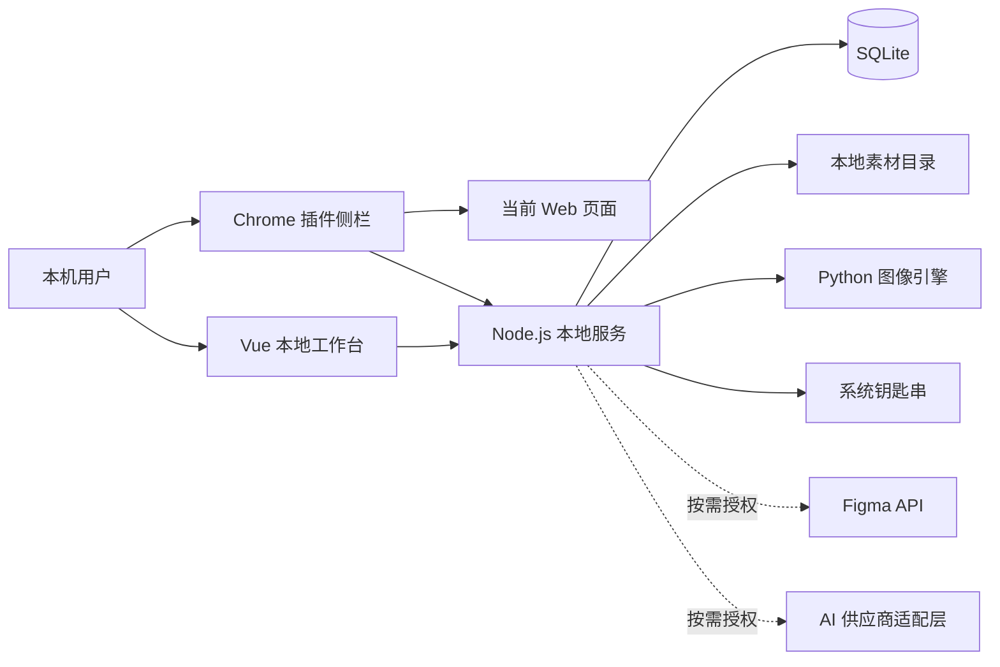
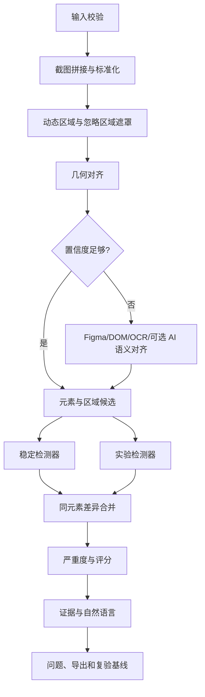

# Vigour UI Review 技术架构

- 文档状态：Development Ready
- 版本：0.0.1
- 日期：2026-08-28
- 对应产品文档：[`../spec/PRODUCT_SPEC.md`](../spec/PRODUCT_SPEC.md)

## 1. Architecture Principles（架构原则）

1. Local-first：核心数据、图片和检测默认只在本机处理。
2. Deterministic core：像素测量、评分和可复现结果不得依赖生成式 AI。
3. Optional intelligence：AI 是按需增强层，失败时核心流程可继续。
4. Evidence before explanation：所有问题先有坐标、数值和证据，再生成自然语言解释。
5. Capability-gated adapters：Figma、OCR 和 AI 供应商必须声明能力，不做静默假设。
6. Least privilege：插件权限、文件访问和外部传输都采用最小授权。
7. Version everything：检测规则、模型配置、输入、算法版本和 JSON Schema 均可追溯。

## 2. System Context（系统上下文）



## 3. Technology Baseline（技术基线）

| 层 | 技术 | 说明 |
| --- | --- | --- |
| Monorepo | pnpm workspace | 共用类型、组件、主题、Schema 和测试夹具 |
| Chrome 插件 | Vue 3 + TypeScript + Vite | 侧栏、设置页、后台协调器、内容脚本 |
| 本地工作台 | Vue 3 + TypeScript + Vite + Ant Design Vue | 项目、对比画布、问题、导出和设置 |
| 本地服务 | Node.js + TypeScript + Fastify | 本地 API、任务编排、存储、导出和适配器 |
| 数据库 | SQLite | 项目、页面、批次、问题、规则和任务元数据 |
| 文件处理 | 本地文件系统 + Sharp | 图片元数据、缩略图、格式转换和导出 |
| 图像引擎 | Python + OpenCV | 对齐、分割、差异区域和几何测量 |
| OCR | PaddleOCR | 中英文文字区域与内容识别 |
| 前端测试 | Vitest + Playwright | 单元、组件和端到端测试 |
| Python 测试 | pytest | 算法、黄金图和性能基准 |

具体依赖版本在工程初始化时锁定；产品文档不绑定尚未验证的版本号。

## 4. Repository Layout（建议目录）

```text
Vigour-UI-Review/
├── apps/
│   ├── extension/           # Chrome 插件
│   ├── workbench/           # 本地 Web 工作台
│   └── local-service/       # Node.js 本地服务
├── engines/
│   └── vision-python/       # OpenCV + PaddleOCR
├── packages/
│   ├── contracts/           # API、事件、JSON Schema、共享类型
│   ├── ui/                  # Vue/AntDV 共用组件
│   ├── themes/              # 预设主题与自定义主题 Schema
│   ├── scoring/             # 评分和严重度规则
│   ├── provider-adapters/   # AI 供应商接口与能力声明
│   └── test-fixtures/       # 脱敏测试页面与黄金结果
├── docs/
└── tooling/
```

## 5. Runtime Components（运行组件）

### 5.1 Chrome 插件

#### Side Panel

- 连接本地服务并显示连接状态。
- 选择项目、页面、设计来源和采集模式。
- 发起当前视口或整页采集。
- 显示进度、问题摘要和“打开完整工作台”。

#### Content Script

- 读取可见 DOM、文字、元素边界和计算后样式。
- 注入临时冻结样式，暂停动画和过渡。
- 触发分段滚动和懒加载。
- 采集忽略区域和用户点击的元素定位信息。
- 不读取跨域 iframe 内部结构。

#### Background Coordinator

- 管理侧栏、标签页、内容脚本和本地服务之间的消息。
- 协调截图、分段拼接元数据和失败重试。
- 保存非敏感插件设置；密钥不进入插件存储。

### 5.2 Vue 本地工作台

- 固定三栏布局：项目导航、对比画布、问题清单。
- 支持三种对比模式和同步缩放/滚动。
- 管理人工对齐、忽略区域、容差、评分和问题状态。
- 设计、开发、QA 是同一问题数据的不同投影。
- 主题只属于表现层，不进入检测引擎。

### 5.3 Node.js 本地服务

- 只监听回环地址。
- 提供项目、采集、运行、问题、导出、Figma 和 AI API。
- 生成任务 ID，管理队列、取消、超时、进度和重试。
- 校验所有文件路径、扩展名、大小、MIME 和 Schema。
- 通过文件路径和 JSON-RPC 调用 Python 引擎，避免在进程间传输大图片字节。
- 管理 SQLite 事务和本地素材目录原子写入。
- 从系统钥匙串按需读取 Figma Token 和 AI Key。

### 5.4 Python 图像引擎

- 作为 Node 服务启动和监控的长期子进程运行。
- 通过 stdio JSON-RPC 接收任务，输入输出使用已校验的本地文件路径。
- 任务必须支持进度事件、取消标记、超时和确定性随机种子。
- 每次结果记录引擎版本、模型版本和参数哈希。

### 5.5 外部适配器

#### Figma Adapter

- MVP：Personal Access Token。
- 预留：OAuth 授权接口。
- 输入：Figma URL、File Key、Node ID。
- 输出：渲染图、节点树、样式、文字、边界和来源元数据。

#### AI Provider Adapter

统一接口：

```text
ProviderCapabilities
- textInput
- imageInput
- structuredOutput
- streaming
- maxImageCount
- maxPayloadBytes

analyze(request, consentReceipt) -> normalizedResult
```

首批适配 OpenAI、Gemini、Kimi、DeepSeek。供应商名称不等于模型能力；每个模型配置必须经过能力检查。视觉能力不可用时，只允许发送结构化差异和文字。

## 6. Local Security Boundary（本地安全边界）

本地服务属于高价值攻击面，因为普通网页可能尝试访问 localhost。必须同时满足：

1. 绑定 `127.0.0.1`/`::1`，禁止监听所有网卡。
2. 首次启动生成高熵会话令牌，令牌只通过本机受控启动流程交给插件和工作台。
3. 校验 Origin，并只允许已配置的扩展来源和本地工作台来源。
4. 所有写操作要求会话令牌和 CSRF 防护信息。
5. 不接受任意绝对路径；文件访问限定在应用数据目录和显式导入的文件句柄。
6. 限制请求体、图片尺寸、像素总量、压缩比和任务并发。
7. Figma Token/API Key 只从系统钥匙串读取，禁止进入前端、URL、日志和错误堆栈。
8. AI 上传使用一次性 Consent Receipt，包含供应商、模型、数据类型、文件哈希和时间。
9. 导出文件名和路径进行规范化，防止路径穿越和覆盖任意文件。

## 7. Data Model（数据模型）

### 7.1 Core Tables

#### projects

- id
- name
- description
- tolerance_profile
- pass_threshold
- created_at / updated_at

#### pages

- id
- project_id
- name
- canonical_url
- viewport_preset
- ignore_regions_json
- created_at / updated_at

#### design_sources

- id
- page_id
- type: local_image | figma_frame
- source_uri
- asset_path
- width / height
- file_hash
- figma_node_id
- metadata_json
- created_at

#### captures

- id
- page_id
- type: viewport | full_page | segment
- asset_path
- dom_snapshot_path
- url
- viewport_width / viewport_height / dpr
- scroll_width / scroll_height
- capture_metadata_json
- created_at

#### runs

- id
- page_id
- design_source_id
- capture_id
- parent_run_id
- status
- progress
- engine_version
- rules_snapshot_json
- alignment_id
- score
- pass_status
- started_at / finished_at

#### alignments

- id
- run_id
- mode: geometric | semantic | manual
- scale_x / scale_y
- translate_x / translate_y
- crop_json
- confidence
- evidence_json
- created_at

#### issues

- id
- run_id
- element_key
- title
- plain_description
- severity
- stability: stable | experimental
- confidence
- status
- bbox_json
- evidence_asset_path
- suggestion
- patch_text
- created_at / updated_at

#### issue_diffs

- id
- issue_id
- type
- target_value_json
- actual_value_json
- delta_value_json
- confidence
- source: pixels | dom | figma | ocr | ai

#### artifacts

- id
- run_id
- type: annotated_png | markdown | json | thumbnail | debug
- path
- file_hash
- schema_version
- created_at

### 7.2 Secret References

SQLite 只保存钥匙串条目的逻辑名称、供应商和最后验证时间，不保存 Token/API Key 值。

## 8. File Layout（本地素材目录）

```text
application-data/
├── database.sqlite
├── projects/<project-id>/
│   ├── designs/
│   ├── captures/
│   ├── runs/<run-id>/
│   │   ├── normalized/
│   │   ├── masks/
│   │   ├── evidence/
│   │   └── exports/
│   └── trash/
├── logs/
└── cache/
```

- 数据库先写 pending 记录，文件原子写入成功后再提交 ready 状态。
- 失败任务的临时文件进入清理队列。
- 删除项目先移动到应用内 trash，再由用户确认永久清理。

## 9. Analysis Pipeline（分析流水线）



### 9.1 输入标准化

- 校正 EXIF 方向。
- 转换到统一色彩空间。
- 记录 DPR，不通过简单拉伸掩盖真实尺寸差异。
- 对超长页面分块处理，避免一次性解码造成内存峰值。

### 9.2 整页拼接

- 预滚动触发懒加载。
- 记录每段滚动坐标和时间。
- 识别固定/吸顶元素并去重。
- 使用重叠区域相关性校验拼接位置。
- 拼接置信度不足时保留分段产物并阻止输出虚假的整页坐标。

### 9.3 几何对齐

- 使用边缘金字塔、相位相关、特征点和结构线生成候选变换。
- 对 UI 页面优先使用平移和统一缩放；透视或非均匀缩放必须降低置信度并提示。
- 输出变换矩阵、重叠比例、残差和可视化证据。

### 9.4 语义对齐

- 生成 Figma 节点、DOM 元素、OCR 文字块和视觉区域的统一候选描述。
- 候选评分结合文字相似度、层级、相对位置、尺寸比例和视觉特征。
- AI 只用于低置信度候选重排或组件语义解释。
- 最终像素差值始终基于确定性的坐标变换计算。

### 9.5 差异检测

- 每个检测器输出标准化 `DiffCandidate`。
- 稳定检测器和实验检测器使用独立阈值、指标和版本。
- DOM/Figma 提供结构证据，像素引擎提供视觉证据；证据冲突时保留冲突状态，不强行选择。

### 9.6 合并与评分

- `element_key` 优先来自 Figma/DOM 映射；否则由空间聚类和 OCR 锚点生成。
- 相同 `element_key` 的位置、尺寸、颜色和字体差异进入同一 Issue。
- 评分包只读取版本化规则快照，不读取 UI 当前状态。

## 10. Local API（本地 API 草案）

所有 API 使用版本前缀 `/v1`。

### 10.1 System

- `GET /v1/health`
- `GET /v1/capabilities`
- `GET /v1/events`：SSE 任务进度和状态事件

### 10.2 Projects and Pages

- `GET/POST /v1/projects`
- `GET/PATCH/DELETE /v1/projects/:id`
- `GET/POST /v1/projects/:id/pages`
- `GET/PATCH/DELETE /v1/pages/:id`

### 10.3 Inputs

- `POST /v1/pages/:id/designs/import`
- `POST /v1/pages/:id/figma/import`
- `POST /v1/pages/:id/captures/init`
- `POST /v1/captures/:id/segments`
- `POST /v1/captures/:id/finalize`

### 10.4 Runs

- `POST /v1/runs`
- `GET /v1/runs/:id`
- `POST /v1/runs/:id/cancel`
- `PATCH /v1/runs/:id/alignment`
- `POST /v1/runs/:id/reanalyze`

### 10.5 Issues and Exports

- `GET /v1/runs/:id/issues`
- `PATCH /v1/issues/:id`
- `POST /v1/issues/:id/ai-explain`
- `POST /v1/issues/:id/suggest-patch`
- `POST /v1/runs/:id/exports`

### 10.6 Settings and Providers

- `GET/PATCH /v1/settings`
- `GET/POST /v1/providers`
- `POST /v1/providers/:id/verify`
- `POST /v1/figma/verify`

## 11. Event Model（事件模型）

任务事件至少包含：

- run.queued
- capture.started / progress / completed / failed
- alignment.started / needs_review / completed
- detector.started / progress / completed
- ai.consent_required / started / completed / failed
- export.completed / failed
- run.completed / cancelled / failed

每个事件包含 `event_id`、`run_id`、`timestamp`、`stage`、`progress` 和脱敏后的 `message`，客户端断线重连后可按 `event_id` 补拉。

## 12. JSON Export Contract（JSON 导出契约）

- 顶层必须包含 `schema_version`。
- 包含 product_version、engine_version、rules_snapshot、inputs、alignment、score、issues 和 artifacts。
- 所有坐标明确所属空间：design、capture、aligned 或 viewport。
- 所有颜色明确格式和色彩空间。
- AI 生成字段带 `generated_by`、provider、model 和 consent receipt 引用。
- Schema 采用向后兼容的语义版本策略；破坏性修改提升主版本。

## 13. Performance Budgets（性能预算）

- 普通视口核心检测 P95 ≤ 30 秒。
- 整页截图核心检测 P95 ≤ 90 秒。
- 任务排队反馈 ≤ 1 秒。
- 取消响应 ≤ 3 秒。
- 单任务默认限制一个重型图像 worker；并发由本机内存和 CPU 能力控制。
- 超长图片采用分块和临时文件，禁止无上限常驻内存。

## 14. Failure and Degradation（失败与降级）

| 失败 | 降级策略 |
| --- | --- |
| Figma 访问失败 | 使用已缓存版本或提示上传本地图片 |
| DOM 权限失败 | 继续截图像素检测并标记“无 DOM 增强” |
| 整页拼接失败 | 保存分段截图并允许分段验收 |
| OCR 失败 | 保留视觉区域；用户可授权 AI 或手工命名 |
| 几何对齐低置信度 | 进入人工微调或语义对齐 |
| AI 供应商失败 | 不影响核心结果，保留可重试状态 |
| Python worker 崩溃 | Node 重启 worker；任务从最近持久化阶段重试一次 |
| 磁盘空间不足 | 阻止新任务，保留现有项目，提供清理建议 |

## 15. Testing Strategy（测试策略）

### 15.1 Unit Tests

- 评分、严重度、容差、Schema 和坐标转换。
- AI/Figma 适配器能力判断和错误归一化。
- 路径验证、Origin 校验和同意凭证。

### 15.2 Golden Image Tests

- 每个测试对包含设计图、开发图、人工对齐、预期问题和允许误差。
- 算法输出与黄金结果比较精确率、召回率、坐标误差和合并准确率。
- 稳定能力与实验能力分开统计。

### 15.3 Integration Tests

- 插件采集 → 本地服务 → Python 引擎 → SQLite → 工作台。
- Figma 缓存、Token 失效和限流。
- 四个 AI 适配器的 Mock、能力矩阵、超时和结构化输出校验。

### 15.4 End-to-End Tests

- 当前视口验收。
- 长页面、固定导航、懒加载和忽略区域。
- 人工对齐和重新分析。
- 三种对比模式、角色切换和问题定位。
- PNG、Markdown、JSON 导出。
- 项目关闭后重新打开恢复。

### 15.5 Adversarial Review

每个里程碑测试前执行对抗式审查，重点尝试：

- 恶意图片、压缩炸弹、超大像素和伪造 MIME。
- localhost 跨站请求、Origin 欺骗和路径穿越。
- 动态页面导致的假差异。
- 重复元素被错误合并。
- AI 输出越权、编造 DOM/CSS 或泄露敏感数据。
- 取消、崩溃、断电和磁盘写入失败时的数据一致性。

## 16. Packaging and Delivery（打包与交付）

### MVP

- macOS 本地服务开发安装包，包含 Node 运行时和打包后的 Python 引擎。
- Chrome 插件以已解压目录交付，通过开发者模式安装。
- 提供健康检查、日志目录和卸载说明。

### Reserved

- Windows 路径、钥匙串和安装器适配接口。
- Chrome Web Store 构建与自动更新通道。
- Figma OAuth 回调服务。

## 17. Implementation Milestones（实施里程碑）

### M0 — 工程与契约

- pnpm monorepo、共享类型、JSON Schema、SQLite migration、任务状态机。

### M1 — 采集闭环

- 插件连接、当前视口、整页截图、DOM/CSS 快照、动画冻结和忽略区域。

### M2 — 核心检测 POC

- 标准化、拼接、几何对齐、人工微调、位置/尺寸/颜色/文字/缺失检测。
- 用前 20 组页面快速校准，再扩展到 50 组正式基准。

### M3 — 工作台与报告

- 固定三栏、三种对比模式、问题合并、评分、角色视图、PNG/Markdown/JSON。

### M4 — Figma 与语义对齐

- PAT、Frame/Node 导入、节点映射、OCR 和语义候选匹配。

### M5 — AI 与补丁

- OpenAI、Gemini、Kimi、DeepSeek 适配器、逐次授权、解释、业务逻辑推测和补丁草案。

### M6 — 发布硬化

- 50 组/500 差异基准、性能、钥匙串、本地安全、安装包、恢复与对抗式测试。

## 18. Architecture Decision Summary（决策摘要）

| 决策 | 选择 |
| --- | --- |
| 部署 | 个人本地版 |
| 首发平台 | macOS + Chrome |
| 首发页面 | 桌面 Web |
| 前端 | Vue 3 + TypeScript + Vite + Ant Design Vue |
| 本地服务 | Node.js |
| 图像引擎 | Python + OpenCV + PaddleOCR |
| 存储 | SQLite + 本地素材目录 |
| 设计输入 | 本地图片 + Figma Frame |
| Figma 授权 | PAT 首发，预留 OAuth |
| AI | 用户自备 Key，多供应商适配，逐次授权 |
| 导出 | PNG + Markdown + JSON |
| 自动改代码 | 不做；仅建议和可复制补丁 |
